<!DOCTYPE html> 

<html lang="en">

  <head>
    <!-- <meta http-equiv="refresh" content="0; url=http://www.wepricewindows.com"> -->
    <!-- <META name="y_key" content="868665339a9c6b1f"> -->
    <!-- <meta name="google-site-verification" content="placeholder content" /> -->
    <!-- favicon -->
    <meta name="viewport" content="width=device-width, initial-scale=1.0">
    <meta http-equiv="content-Type" content="text/html; charset=utf-8"/>
    <title>W.E. Price &amp; Associates-Replacement Windows, Doors, Awnings, Enclosures, Decks, Vinyl Siding</title>
    <meta name="description" content="W.E. Price & Associates provides sales, installation, and service on replacement windows, doors, metal awnings, sunrooms, patio covers, vinyl siding, and decks.">
    <link href="static/index.css" rel="stylesheet" type="text/css"/>
    <meta name="author" content="Derek Price">
  </head>

  <body>
    

      

        <a href="TheShop.html"><section id="heading_text">W.E.Price and Associates"A Priceless Investment"</section></a>
        <a href="windows.html">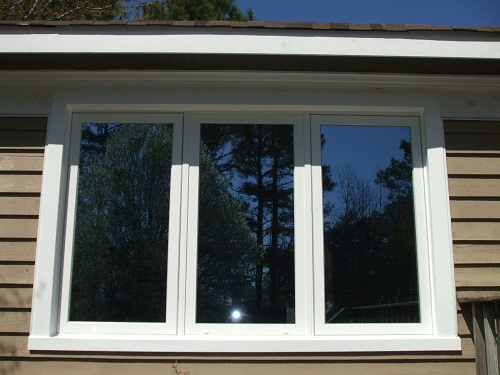</a>
        <a href="decks.html">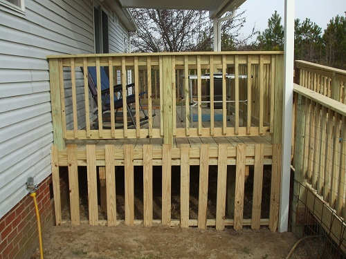</a>
        <a href="sunrooms.html">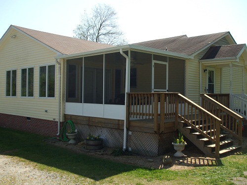</a>
      
 <!-- end #header -->
      
      <nav id="sidebar1">
        
<a href="windows.html">WINDOWS</a>

        
<a href="exteriormakeovers.html">EXTERIOR MAKEOVERS</a>

        
<a href="awnings.html">AWNINGS</a>

        
<a href="VinylSiding.html">VINYL SIDING, TRIM, AND COLUMNS</a>

        
<a href="sunrooms.html">SUNROOMS AND SCREENED-IN PORCHES</a>

        
<a href="patios.html">PATIO COVERS</a>

        
<a href="decks.html">DECKS</a>

        

<b>Industry News</b>

        

          
          
          
          
          
          
        

        

          
757-539-8639

          <h1>
W
</h1>
        

        
        

        
 
        
        

          
Copyright &#169; 2020 W.E. Price & Associates, Incorporated. by <a href="https://www.laserstudio.io">laserstudio.io</a>

        
 <!-- end #copyright -->
      </nav><!-- end #sidebar1 -->

      
 
        <h2 id="spectext"><a href="windows.html" title="Windows">Windows, Doors, Exterior Renovations, and More</a></h2>
        
<main>W. E. Price and Associates is a boutique-style exterior contractor offering aesthetic and energy-efficient solutions for all of your home improvement needs. Since 1989, we have been providing Hampton Roads with high quality vinyl replacement windows, doors, awnings, custom decks, sunrooms, and patio covers.  We work closely with you during every phase of the project from planning to post-installation. Call us at 757-539-8639 for a free appointment. Feel free to browse our site; all of the pictures are jobs that we have completed.</main>

        <section id="main-pics"><a href="Windows0167.html">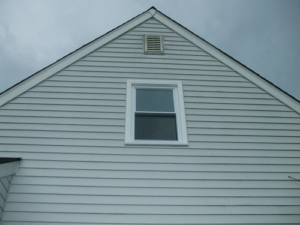</a>
          <a href="Doors0098.html">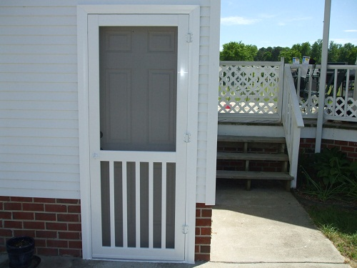</a>
          <a href="Windows0132.html">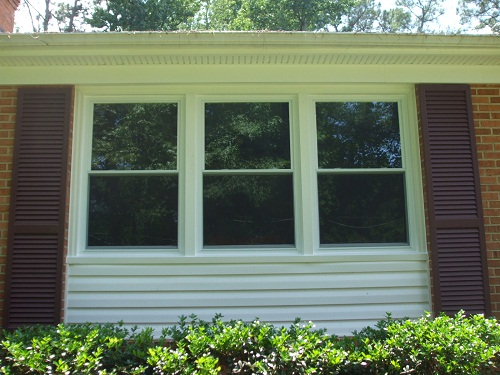</a>
          <a href="Doors0175.html">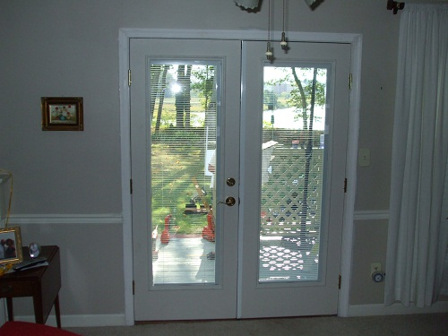</a>
        </section>
        

        <h2 id="spectext"><a href="windows.html" title="Windows">Replacement Windows</a></h2>
        
One of the simplest ways to freshen your home  is to install new replacement windows. Windows can be different styles including double-hungs, sliders, picture windows, or casement windows, according to your tastes and needs. With the latest in green technology, you can rest assured that your new windows help to save your money as well as the environment. Below are some photos of recent jobs:

        <section id="main-pics">
          <a href="Windows0283.html">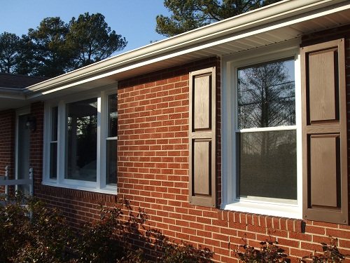</a>
          <a href="Windows0324.html">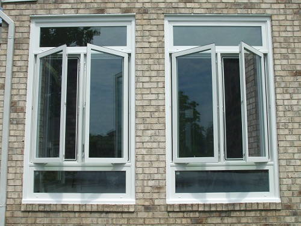</a>
          <a href="Windows0246.html">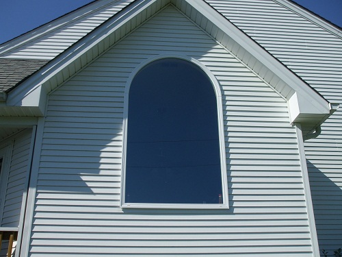</a>
          <a href="Windows0318.html">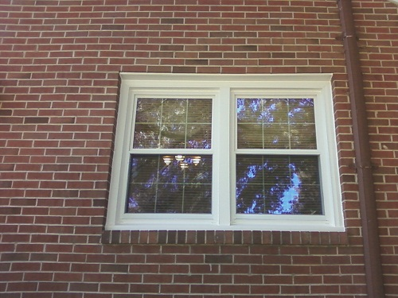</a>
        </section>
        

        <h2 id="spectext"><a href="awnings.html" title="Awnings">Awnings</a></h2>
        
Awnings are a great addition to your home or business, and a great energy saver too. Cut down on that bright sunlight and your energy bill! 

        <section id="main-pics">
          <a href="Awnings0109.html">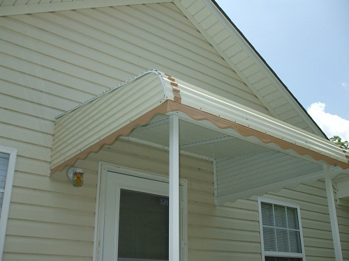</a>
          <a href="Awnings0295.html">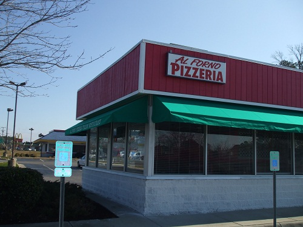</a>
          <a href="Awnings0333.html">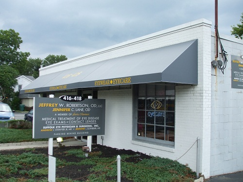</a>
          <a href="Awnings0330.html">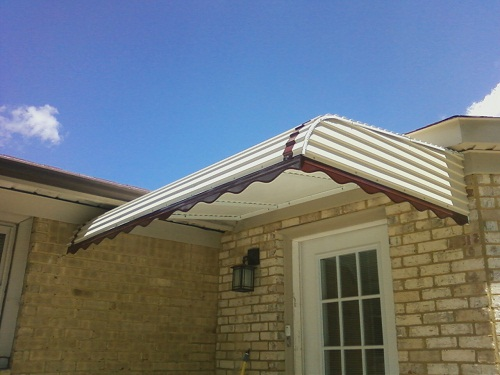</a>
        </section>
        

        <h2 id="spectext"><a href="sunrooms.html" title="Sunrooms">Sunrooms and Screened-In Porches</a></h2>
        
Call us about constructing a new sunroom if you would like to know more about pet rooms, plant rooms, a new home office, or anything else.

        <section id="main-pics">
          <a href="Sunrooms0080.html">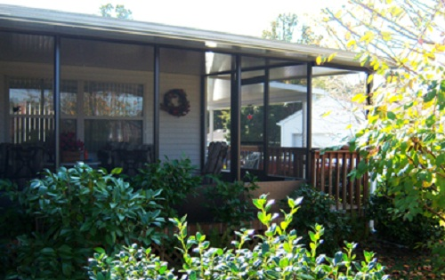</a>
          <a href="Sunrooms0010.html">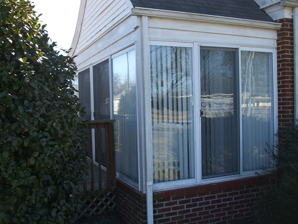</a>
          
          

        </section>
      

      

        <h2><a href="contact.html">Contact Us</a></h2>
        <aside id="paratext">Conveniently located in Suffolk, VA, W.E. Price &amp; Associates sells <b>vinyl replacement windows, entry doors, aluminum awnings, custom decks, patio covers, enclosures, sunrooms,</b> trim, and <b>vinyl siding</b>. We also specialize in the renovation and preservation of historic buildings. Let us give you a free estimate and explain how we will work with you to find the most attractive and green solutions for your next exterior project. We carry all of the best names in the business including West Window, Simonton, Alside, and more. Feel free to browse our site-let us know when you're ready to make a &quot;priceless&quot; investment in your home or business with W.E. Price &amp; Associates.</aside>
        <h2 id="spectext"> We Do Historic Renovations!</h2>
        
While final plans for a historic renovation generally need to be approved by a historical commission, we carry storm windows that are recognized and nationally recommended as the standard in historic structures.  If you own a home, church, office building, or other structure in an Old Town or a historical area, getting replacement windows that are approved can be difficult.

        
Call us for windows that meet the standards!

      
<!-- end #sidebar2 -->

    
      

    
 <!-- end #container -->
    
    <!-- 
    
    
     -->
  </body>
</html>
